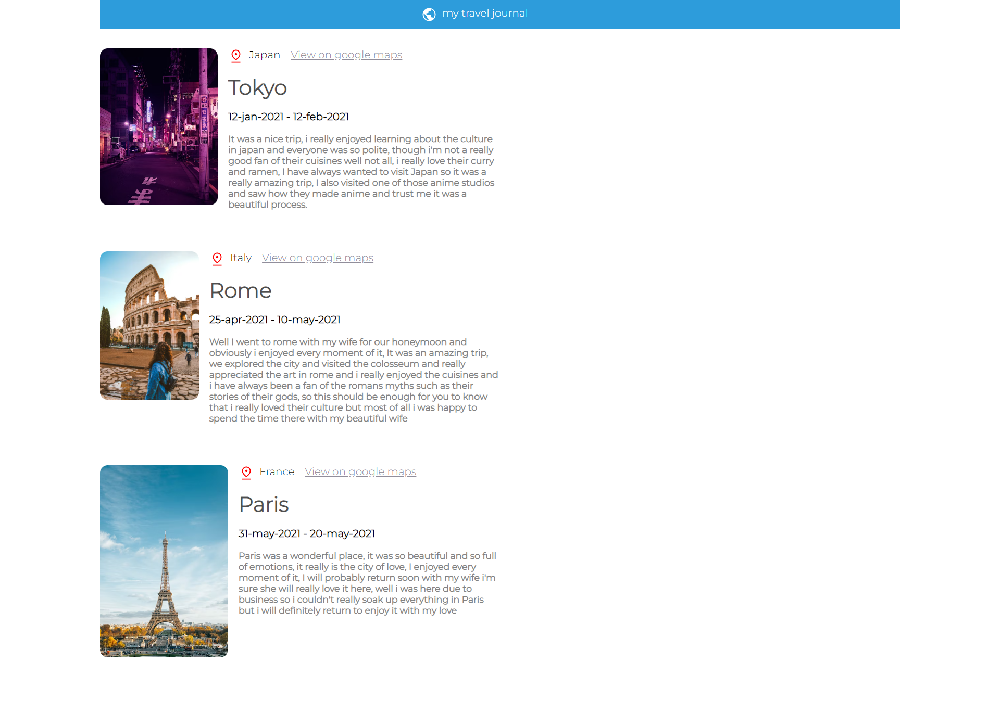

<!-- Please update value in the {}  -->

<h1 align="center">Travel Journal</h1>

<!-- TABLE OF CONTENTS -->

## Table of Contents

- [Overview](#overview)
  - [Built With](#built-with)
- [Contact](#contact)

<!-- OVERVIEW -->

## Overview

### Built With

<!-- This section should list any major frameworks that you built your project using. Here are a few examples.-->

- [React](https://reactjs.org/)
- [CSS](https://web.dev/learn/css/)

## Contact

- GitHub [@precious654](https://github.com/precious654)
- Twitter [@sacredshott](https://twitter.com/sacredshott)
